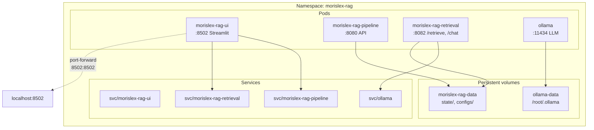
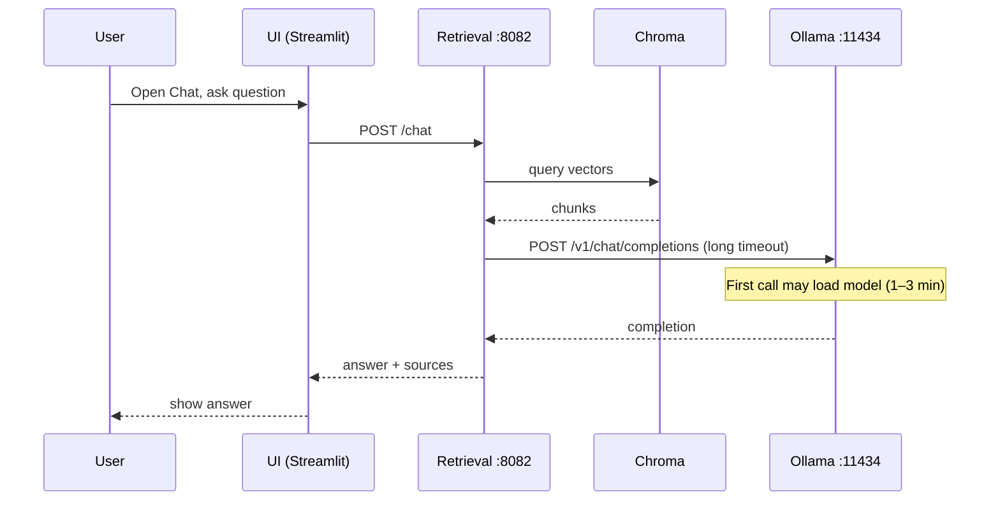
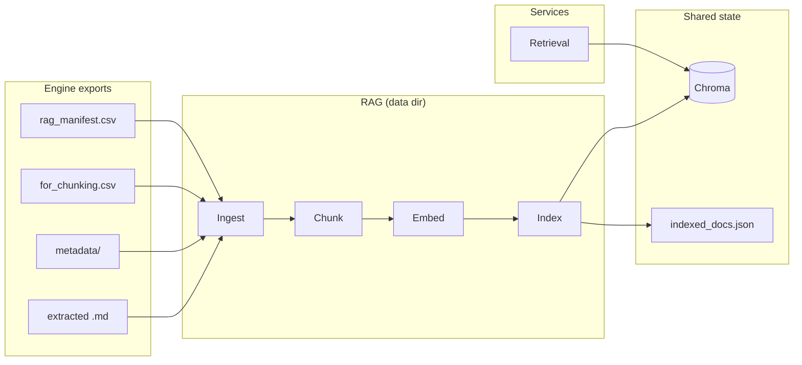

# MORISLEX-RAG — Architecture (K8s, Ollama, Data Flow)

**Obsidian:** **01 - Projects/MorisLex Rag**. Index: [[index]]. Engine: [[01 - Projects/MorisLex Engine/ARCHITECTURE-MORISLEX|Engine architecture]].

This note describes the RAG project’s deployment topology, services, and data flow — including in-cluster Ollama and how to access the Streamlit UI.

---

## 1. Kubernetes deployment (Rancher Desktop)

Four main workloads run in the `morislex-rag` namespace:

| Deployment | Port | Role |
|------------|------|------|
| **morislex-rag-ui** | 8502 | Streamlit: Dashboard, Pipeline, Config Center, Insights, Chat, Logs. |
| **morislex-rag-pipeline** | 8080 | Pipeline worker: ingest → chunk → embed → index (triggered by UI). |
| **morislex-rag-retrieval** | 8082 | Retrieval + RAG chat: `/retrieve`, `/chat`; reads Chroma; calls Ollama. |
| **ollama** | 11434 | In-cluster LLM server; models pulled by `deploy.sh`; primary model warmed up for Chat. |

All share the same **PVC** for `state/` (Chroma, indexed_docs.json) and `configs/`. Ollama uses a separate **ollama-data** PVC for models.

---

## 2. Request flow: Chat

1. User opens **http://localhost:8502** (via port-forward from deploy script or LoadBalancer).
2. Chat page sends the question to **Retrieval** (`POST /chat`).
3. Retrieval: retrieves chunks from Chroma → builds prompt → calls **Ollama** (`/v1/chat/completions`) → returns answer + sources.
4. First request to Ollama triggers **model load** (1–3 min on CPU); the client uses a long timeout (600s) so the connection is not closed mid-load.

---

## 3. Pipeline and data flow

- **Data dir** (configurable): points at Engine exports (or copy): `rag_manifest.csv`, `for_chunking.csv`, `metadata/`, extracted `.md`.
- **Pipeline** (triggered from UI): Ingest → Chunk → Embed → Index (Chroma + `indexed_docs.json`).
- **Retrieval** only reads Chroma and indexed state; it does not run the pipeline. So Chat/Insights do not block indexing.

---

## 4. Local run (no K8s)

- **`./deploy.sh --local`**: Streamlit + pipeline **in-process** on the host. Uses Apple Silicon (MPS) for embedding when available. Ollama or LM Studio on the host for Chat (Config Center: base URL).

---

## 5. Accessing the Streamlit UI

| How you deployed | How to open the UI |
|------------------|--------------------|
| **`./deploy.sh`** (script still running) | **http://localhost:8502** — script holds the port-forward. |
| **Script stopped** | Run: `kubectl port-forward -n morislex-rag svc/morislex-rag-ui 8502:8502` then open http://localhost:8502. |
| **LoadBalancer** (Rancher Desktop) | Use the URL printed by deploy, e.g. **http://192.168.64.2:8502** (no port-forward needed). |
| **`./deploy.sh --local`** | **http://localhost:8502** (app runs on host). |

---

## 6. Key file reference

| Purpose | Path |
|--------|------|
| Deploy (build, apply, rollouts, Ollama pull/warm-up, port-forward) | `deploy.sh` |
| K8s base (UI, pipeline, retrieval, Ollama, PVCs, network policies) | `k8s/base/` |
| Retrieval service (FastAPI, /health, /retrieve, /chat) | `app/services/retrieval_service.py` |
| Ollama client (long timeout for model load) | `app/llm/client_ollama.py` |
| Pipeline worker | `app/services/pipeline_worker.py` |
| Obsidian sync (push/pull) | `make sync-blueprints-to-obsidian` (set `OBSIDIAN_VAULT`) |

---

## 7. Related docs

- [[IMPLEMENTATION-AND-OPS]] — summary; full guide in Engine: [[01 - Projects/MorisLex Engine/MORISLEX-RAG-IMPLEMENTATION-AND-OPS]]
- [[problems-and-fixes]] — Ollama 499, retrieval CrashLoopBackOff, Pending Ollama, rollout timeouts.
- [[RETRIEVAL-API]] — POST /retrieve, /chat, model tiers.
- [[DEPLOYMENT-RUNBOOK]] — step-by-step deploy and troubleshooting.
