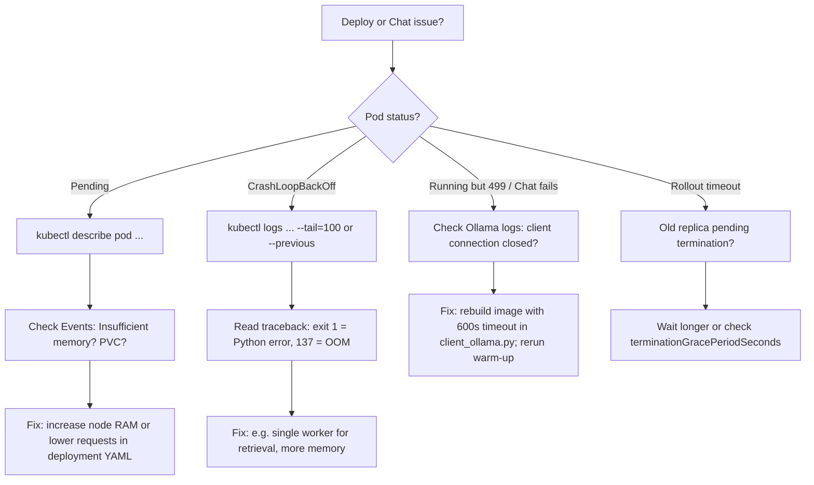

# MORISLEX-RAG — Deployment Runbook

**Obsidian:** **01 - Projects/MorisLex Rag**. Index: [[index]]. Architecture: [[ARCHITECTURE-RAG]].

Step-by-step deploy, access, and troubleshooting for K8s (Rancher Desktop) and local run.

---

## 1. Prerequisites

- **Rancher Desktop** (or another Kubernetes cluster) with Kubernetes enabled, `kubectl` on PATH.
- **Docker** (for building `morislex-rag:latest`).
- Optional: **Obsidian** vault path for doc sync (`OBSIDIAN_VAULT`).

---

## 2. Deploy to Kubernetes (Rancher Desktop)

```bash
cd /path/to/MorisLex-Rag
./deploy.sh
```

**What it does:**

1. Builds `morislex-rag:latest` and (if present) applies K8s from `k8s/overlays/local` or `k8s/base`.
2. Restarts UI, Pipeline, Retrieval deployments; waits for rollouts (UI 180s, Pipeline 120s, Retrieval 180s, Ollama 600s).
3. If Ollama is ready: pulls models in-cluster (`qwen2.5:3b`, `qwen2.5:0.5b`, `llama3.2:1b`), runs warm-up (port-forward + curl with 600s timeout so model load is not aborted).
4. Starts **port-forward** for the UI (8502 → 8502) and prints the Streamlit URL.

**Access the UI:** Open **http://localhost:8502** while the script is running. If you stop the script, run:

```bash
kubectl port-forward -n morislex-rag svc/morislex-rag-ui 8502:8502
```

Then open http://localhost:8502 again.

**Alternative (no port-forward):** If a LoadBalancer is configured, use the URL printed by deploy (e.g. `http://192.168.64.2:8502`).

---

## 3. Local run (GPU / no K8s)

```bash
./deploy.sh --local
```

Runs Streamlit on the host with pipeline in-process; uses MPS (Apple Silicon) when available. Point Config Center at local Ollama (e.g. `http://localhost:11434`) or LM Studio. Open http://localhost:8502.

---

## 4. Other deploy options

| Command | Effect |
|--------|--------|
| `./deploy.sh --status` | Show pods and services. |
| `./deploy.sh --down` | Tear down namespace and resources. |
| `./kill.sh` | Full teardown (namespace, etc.). |

---

## 5. Troubleshooting (quick reference)

| Symptom | What to do |
|--------|------------|
| **Ollama pod Pending** | `kubectl describe pod -n morislex-rag -l component=ollama` → check **Events** (often "Insufficient memory"). Increase node RAM or lower Ollama resources in `k8s/base/ollama-deployment.yaml`. |
| **Retrieval CrashLoopBackOff** | `kubectl logs -n morislex-rag -l component=retrieval --tail=100` (or `--previous`). Single-worker run; do not use `workers=2` in container (fork + ML libs can crash). See [[problems-and-fixes]]. |
| **Ollama "client connection closed" / 499** | Rebuild image so retrieval uses long Ollama timeout (600s). Redeploy; ensure warm-up runs with port-forward + curl (long timeout). |
| **Retrieval rollout timeout** | Old replica pending termination: increased rollout wait (180s) and `terminationGracePeriodSeconds: 25` on retrieval. If still slow, check `kubectl describe pod -n morislex-rag -l component=retrieval`. |
| **"Documents: 0, Chunks: 0"** | Data path in pipeline pod must match where Engine data is mounted. Use Config Center → Data folder; validate. For path check: `kubectl port-forward -n morislex-rag svc/morislex-rag-pipeline 8081:8080` then http://localhost:8081/check-path?path=/data. |
| **Chat 500 / connection errors** | `make logs` or `kubectl logs -n morislex-rag -l component=retrieval --tail=50` and `kubectl logs -n morislex-rag -l component=ollama --tail=50`. |

---

## 6. Sync docs to Obsidian

From the RAG repo, with vault path set:

```bash
export OBSIDIAN_VAULT=~/path/to/your/vault
make sync-blueprints-to-obsidian
```

Copies `docs/*.md` and Engine RAG blueprints into **01 - Projects/MorisLex Rag**. Pull changes back from Obsidian:

```bash
make sync-blueprints-to-engine
```

---

## 7. Troubleshooting flowchart



---

## 8. Related

- [[ARCHITECTURE-RAG]] — diagrams and data flow.
- [[problems-and-fixes]] — detailed fixes (Ollama, retrieval, probes, resources).
- [[01 - Projects/MorisLex Engine/MORISLEX-RAG-IMPLEMENTATION-AND-OPS]] — full implementation and ops (Engine repo).
